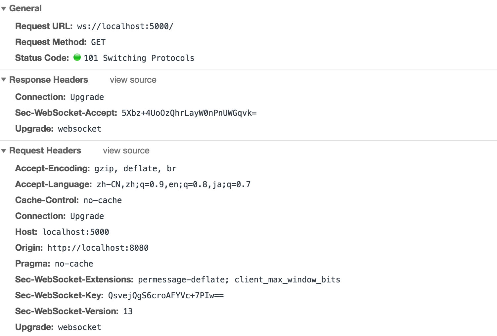

## WebSocket

### WebSocket 建立连接



这是一个 `http get` 请求报文，注意该报文中有一个 `upgrade`首部，它的作用是告诉服务端需要将通信协议切换到 `websocket`。

如果服务端支持 websocket 协议，那么它就会将自己的通信协议切换到 websocket，同时发给客户端一个响应报文头。

返回的状态码为 101，表示同意客户端协议转换请求，并将它转换为 websocket 协议。

以上过程都是利用 http 通信完成的，称之为 websocket 协议握手(websocket Protocol handshake)

总结：websocket 握手需要借助于 http 协议，建立连接后通信过程使用 websocket 协议。

### WebSocket 原理

WebSocket 是 HTML5 一种新的协议。它实现了浏览器与服务器全双工通信，能更好的节省服务器资源和带宽并达到实时通讯，它建立在 TCP 之上，同 HTTP 一样通过 TCP 来传输数据，但是它和 HTTP 最大不同是。

- WebSocket 是一种双向通信协议，在建立连接后，WebSocket 服务器和 Browser/Client Agent 都能主动的向对方发送或接收数据，就像 Socket 一样
- WebSocket 需要类似 TCP 的客户端和服务器端通过握手连接，连接成功后才能相互通信

**客户端发送数据格式类似于下面的内容**

```js
GET /webfin/websocket/ HTTP/1.1
Host: localhost
Upgrade: websocket
Connection: Upgrade
Sec-WebSocket-Key: xqBt3ImNzJbYqRINxEFlkg==
Origin: http://localhost:8080
Sec-WebSocket-Version: 13
```

客户端发起的 WebSocket 连接报文类似传统 HTTP 报文，`Upgrade：websocket` 参数值表明这是 WebSocket 类型请求，`Sec-WebSocket-Key` 是 WebSocket 客户端发送的一个 base64 编码的密文，要求服务端必须返回一个对应加密的 `Sec-WebSocket-Accept` 应答。

**服务端收到报文后返回的数据格式类似于如下内容**

```js
HTTP/1.1 101 Switching Protocols
Upgrade: websocket
Connection: Upgrade
Sec-WebSocket-Accept: K7DJLdLooIwIG/MOpvWFB3y3FE8=
```

`Sec-WebSocket-Accept` 的值是服务端采用与客户端一致的密钥计算出来后返回客户端的，`HTTP/1.1 101 Switching Protocols` 表示服务端接受 WebSocket 协议的客户端连接，经过这样的请求-响应处理后，客户端服务端的 WebSocket 连接握手成功, 后续就可以进行 TCP 通讯了。

**总结**

在 WebSocket API，浏览器和服务器只需要要做一个握手的动作(HTTP GET)，然后，浏览器和服务器之间就形成了一条快速通道。两者之间就直接可以数据互相传送，改变了原有的B/S模式。

### WebSocket 与 HTTP 比较

**相同点**

- 都是基于TCP的应用层协议
- 都使用Request/Response模型进行连接的建立
- 在连接的建立过程中对错误的处理方式相同，在这个阶段WS可能返回和HTTP相同的返回码
- 都可以在网络中传输数据

**不同点**

- WS使用HTTP来建立连接，但是定义了一系列新的header域，这些域在HTTP中并不会使用
- WS的连接不能通过中间人来转发，它必须是一个直接连接
- WS连接建立之后，通信双方都可以在任何时刻向另一方发送数据
- WS连接建立之后，数据的传输使用帧来传递，不再需要Request消息
- WS的数据帧有序

### 参考链接

- [初步认识 WebSocket 技术](http://www.52im.net/forum.php?mod=viewthread&tid=331&ctid=15)
- [WebSocket 技术原理](http://www.52im.net/forum.php?mod=viewthread&tid=326&ctid=15)
- [深入WebSocket通信协议细节](http://www.52im.net/forum.php?mod=viewthread&tid=332&ctid=15)
